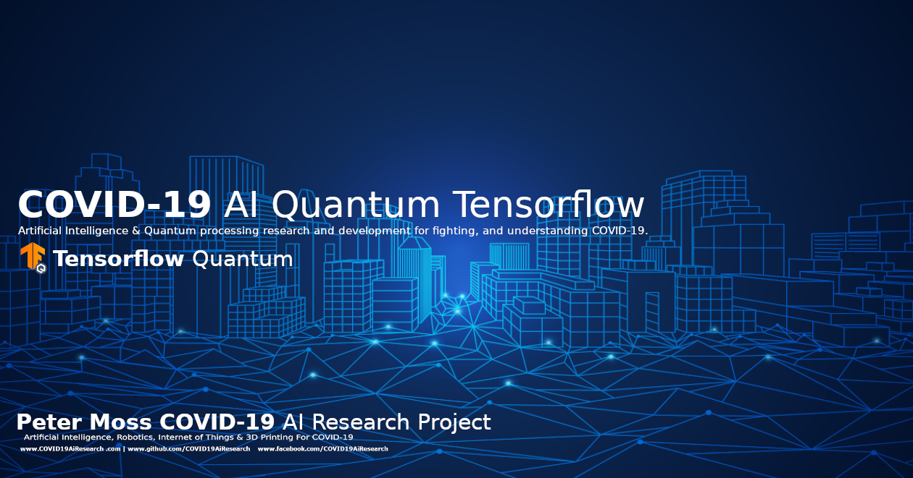

# Peter Moss COVID-19 AI Research Project

## COVID-19 AI Quantum Tensorflow

[](https://github.com/COVID-19-AI-Research-Project/COVID19-AI-Quantum-Tensorflow)

# Installation & Setup
Here you will find all of the required setup steps to get all required packages installed.

&nbsp;

# Clone the repository

Clone the [COVID19-AI-Quantum-Tensorflow](https://github.com/COVID-19-AI-Research-Project/COVID19-AI-Quantum-Tensorflow "COVID19-AI-Quantum-Tensorflow") repository from the [Peter Moss Acute Myeloid & Lymphoblastic COVID-19 AI Research Project](https://github.com/COVID-19-AI-Research-Project "Peter Moss COVID-19 AI Research Project") Github Organization.

To clone the repository and install the COVID19 AI Quantum Tensorflow repository, make sure you have Git installed. Now navigate to the location you want to clone the repository to on your device using terminal/commandline, and then use the following command.

The **-b "0.1.0"** parameter ensures you get the code from the latest development branch. Before using the below command please check our latest development branch in the button at the top of this page.

```
  $ git clone -b "0.1.0" https://github.com/COVID-19-AI-Research-Project/COVID19-AI-Quantum-Tensorflow.git
```

Once you have used the command above you will see a directory called **COVID19-AI-Quantum-Tensorflow** in the location you chose to clone to. In terminal, navigate to the **COVID19-AI-Quantum-Tensorflow** directory, this is your project root directory.

## Developer Forks
Developers from the Github community that would like to contribute to the development of this project should first create a fork, and clone that repository. For detailed information please view the [CONTRIBUTING](https://github.com/COVID-19-AI-Research-Project/COVID19-AI-Quantum-Tensorflow/blob/master/CONTRIBUTING.md "CONTRIBUTING") guide.

&nbsp;

# Tensorflow Quantum
You will need to install [Tensorflow Quantum](https://www.tensorflow.org/quantum/install "Tensorflow Quantum") and [Cirq](https://cirq.readthedocs.io/en/stable/tutorial.html "Cirq"). Use the following commands to install the correct package of Tensorflow & Cirq.

```
pip install tensorflow==2.1.0
pip install cirq==0.7.0
pip install tensorflow-quantum
```

&nbsp;

# Contributing

The Peter Moss Acute Myeloid & Lymphoblastic Leukemia AI Research project encourages and welcomes code contributions, bug fixes and enhancements from the Github.

Please read the [CONTRIBUTING](https://github.com/COVID-19-AI-Research-Project/COVID19-AI-Quantum-Tensorflow/blob/master/CONTRIBUTING.md "CONTRIBUTING") document for a full guide to forking our repositories and submitting your pull requests. You will also find information about our code of conduct on this page.

## Contributors

- **AUTHOR:** [Adam Milton-Barker](https://www.leukemiaresearchassociation.ai//team/adam-milton-barker "Adam Milton-Barker") - [Peter Moss Leukemia AI Research](https://www.leukemiaresearchassociation.ai "Peter Moss Leukemia AI Research") Founder & Intel Software Innovator, Sabadell, Spain

&nbsp;

# Versioning

We use SemVer for versioning. For the versions available, see [Releases](https://github.com/COVID-19-AI-Research-Project/COVID19-AI-Quantum-Tensorflow/releases "Releases").

&nbsp;

# License

This project is licensed under the **MIT License** - see the [LICENSE](https://github.com/COVID-19-AI-Research-Project/COVID19-AI-Quantum-Tensorflow/https://github.com/COVID-19-AI-Research-Project/COVID19-AI-Quantum-Tensorflow/blob/master/LICENSE "LICENSE") file for details.

&nbsp;

# Bugs/Issues

We use the [repo issues](https://github.com/COVID19-Medical-Support-System-Server/issues "repo issues") to track bugs and general requests related to using this project. See [CONTRIBUTING](https://github.com/COVID19-Medical-Support-System-Server/blob/master/CONTRIBUTING.md "CONTRIBUTING") for more info on how to submit bugs, feature requests and proposals.